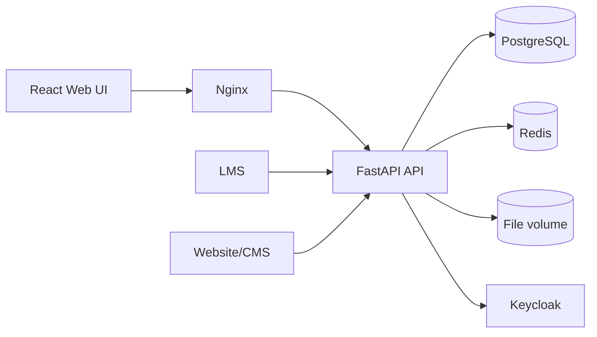

# Архитектура

## Компонентная схема

`docs/architecture.xml` — ArchiMate Model Exchange файл, который можно импортировать в Archi для дальнейшей детализации модели.

## Функциональные блоки

- каталоги ВУЗов, ИТ-направлений, ИТ-продуктов и ответственных;
- workflow и история переходов;
- комментарии и вложения;
- отчёты XLS/XLSX/PDF/JSON и экспорт диаграмм PNG/PDF;
- RBAC и data-scope через Keycloak;
- импорт XLS/XLSX;
- интеграционный ingest LMS/website с идемпотентностью по `source + external_id`;
- аудит административных и пользовательских действий.
